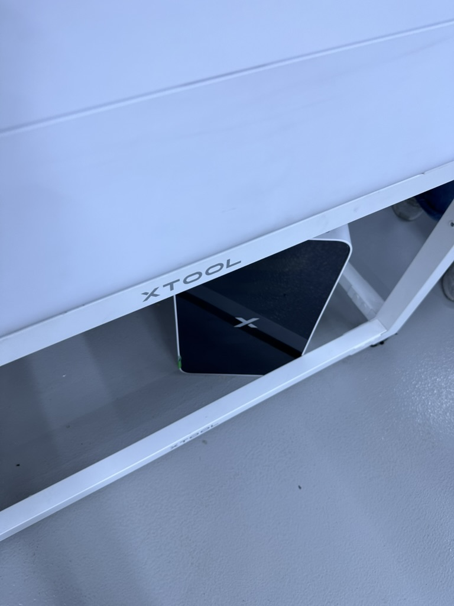
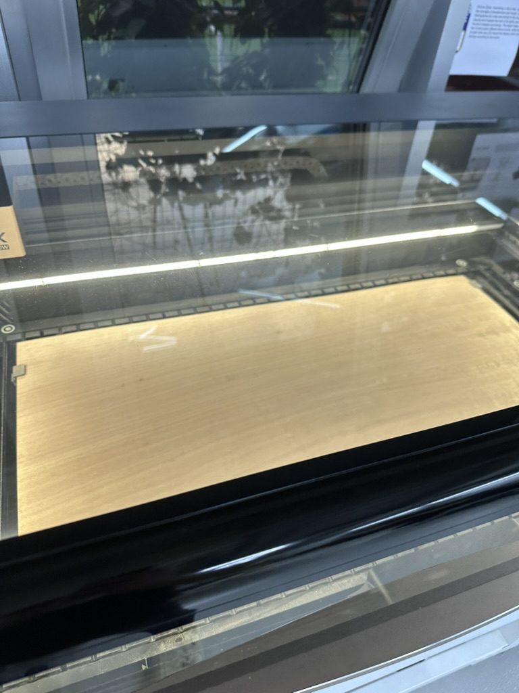
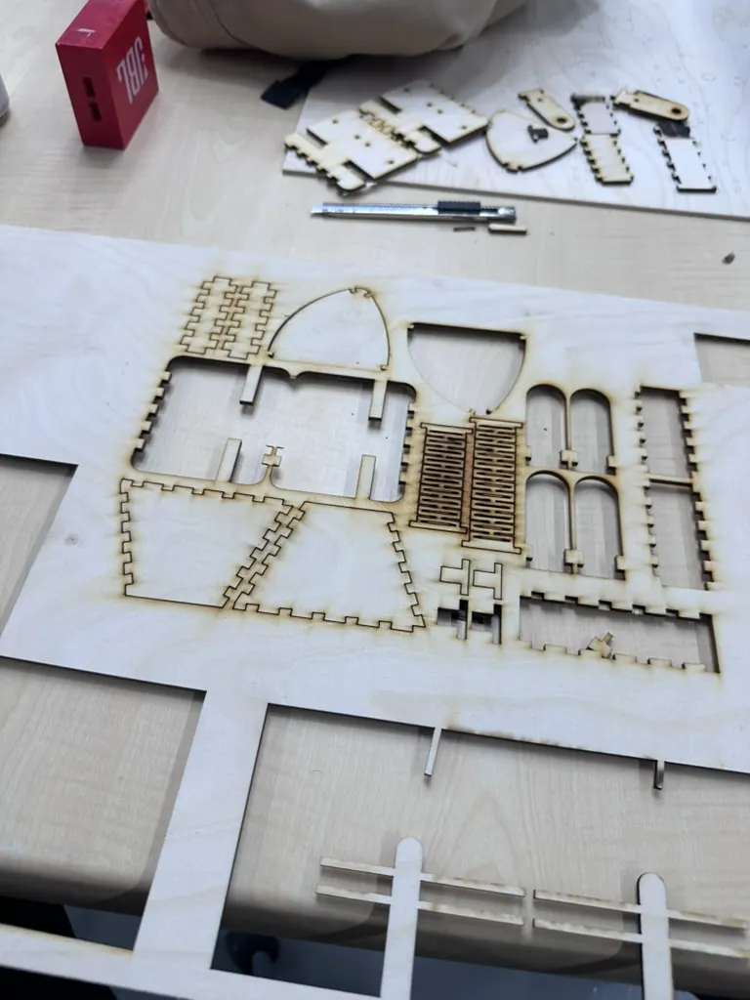
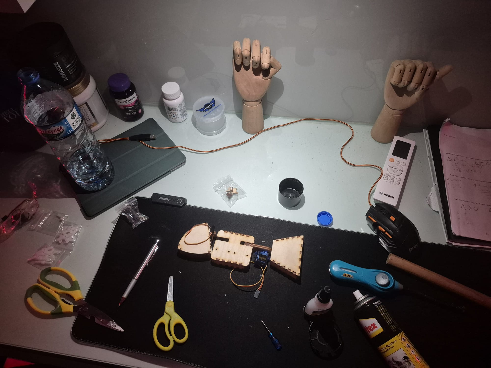
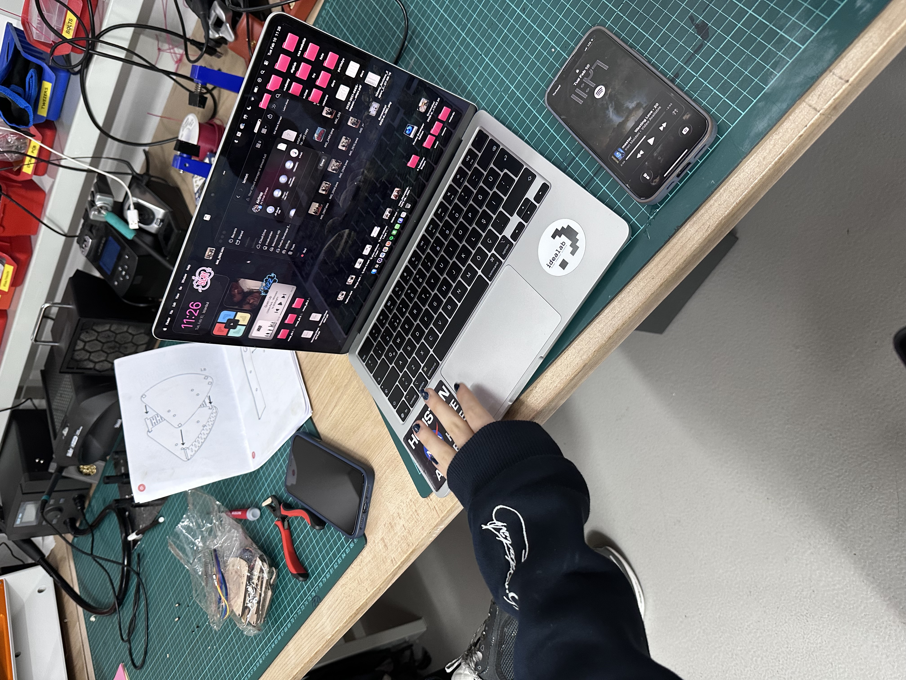
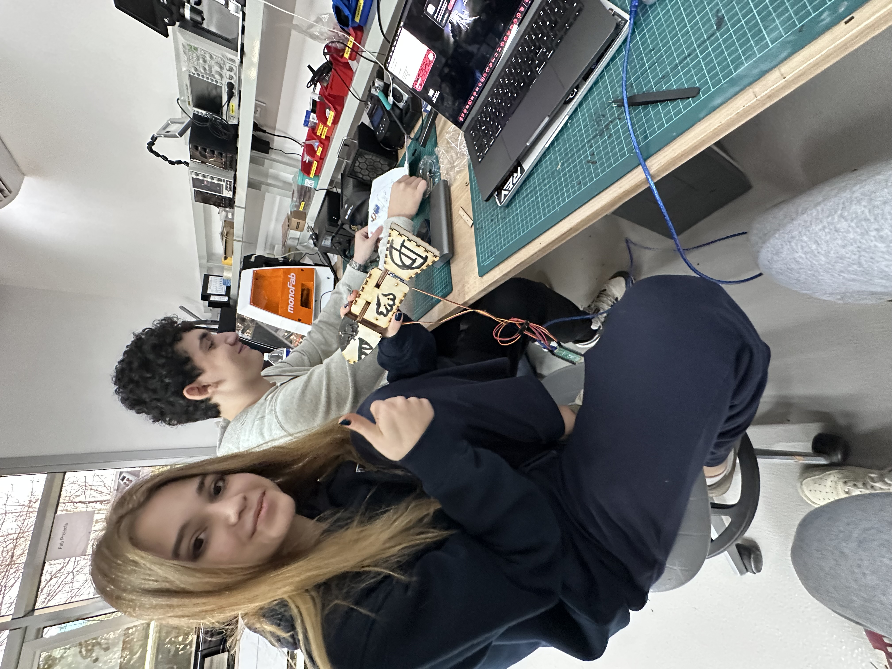

# Lemon

## **Lemon Fish Project**

1. I got the drawing of the fish from Emre.
2. The drawing isn’t enough so i had to use a ruler and measure the lengths and the heights of the fish parts.
3. After measuring i changed the document I got from Emre to an png and downloaded it to Onshape.
    
    [Copy of lime son comp (1).ai](Lemon/Copy_of_lime_son_comp_(1).ai)
    
4. After downloading the document to Onshape I opened a new document and inserted the png to the document.
5. I renamed the document Lemon Fish Project and started sketching on the top lane.
6. I used line, spline, 3 point circle, conic circle to draw the same lines that are also on the sketch.
7. Instead of repeating the same lines again and again i used commands and tools like copy and paste, Linear pattern, mirror, offset and lastly transform which really improved my work efficiency. 
8. Instead of extruding everything that is included on the sketch i handpicked the parts I wanted to extrude so later I wouldn’t have to extrude again to make the holes on the parts.
9. This really saved me up on time.
10. Lastly I made sure I added constraints so if changed any length or height while printing it it would also match the other lengths or parts to make it always give us the print we wanted.
11. It is also important to mention this because it makes our design a lot more thought trough.
12. After that I added colors to it by right clicking on the shapes to make it easier on eyes.
13. And lastly I took an screenshot, created a share-link and exported it with 3mf form which makes it ready to print.
14. I had a lot of fun while designing this project and it really helped me improve my efficiency and speed while designing on Onshape.

Here are the attachments:

[Lemon Fish Project Onshape](https://cad.onshape.com/documents/a4d269636272a0114b9d8d56/w/07776243a2c53176185dd7c7/e/d81a157bf7419143375b6744?renderMode=0&uiState=6967559cbe5b1bf69df68710) 

[Part Studio 1.3mf](Lemon/Part_Studio_1.3mf)

***ScreenShot of Design***

1. After I finished the design on 3d I had to make it 2D in order to make it printable on the xToolP3 laser printer.
2. I pressed the + icon and then picked drawing. After that it asked me what image tool to use on the drawing, I picked the one Onshape provided since it was the most effective. 
3. Lastly for the drawing it asked me which parts to include and I picked Part Studio 1 because it includes all of the parts and that would be more effective then picking all the parts by hand. 
4. It generated a 2D drawing for me and I had to put an scale model and then my design. For it to be less confusing I deleted everything else other then my design and exported it the same way I exported a design for 3D but this time I picked SVG format since it was the most compatible with our tool.
    
    
    
    
    ***Creating Drawing***
    
    
    
    ***Exporting***
    
5. I sent the SVG file to 3D Hisar mail, opened the xToolP3 and also the computer connected to it.
6. I downloaded the SVG file on that computer and inserted the file to the app of xTool, I measured one of the parts of a finished Lemon fish and then changed the dimensions of the design on the app until the part I measured from the finished version matched the same part on the app. 
7. This made sure that all of the parts had the dimensions that we wanted meaning the same as the finished product I measured from. Also it is important to mention that using the measure tool on the xToolP3 app is very helpful while making sure the dimensions are what we want.
8. I prepared the laserCutter by measuring the material, putting it inside the machine and strapping it, opening the ventilation machine so while printing it wouldn't smell horrible and cleaning the circles inside the machine so it could scan the material. After that I opened and closed the lid of the machine until it scanned the material.

***Ventilator***

***Material***

1. Since I measured the material it was easy for me to pick the cutting settings (Power and Speed) because it had saved options for multiple materials, I just had to find and select my material according to my measurement and pick how I wanted my cutting to look that automatically set the settings according to it.
2. After that I pressed continue and the start button on the machine.

***xToolP3 App***

1. It started printing but something went wrong and the machine only engraved it. I tried again and this time the machine burned it. Turns out the machine was broken.

***xToolP3 Working***

1. The available teacher tried fixing it by cleaning the lenses of the machine and even cleaned some inside part of it but it was futile. 
2. I thought if the machines speed and power settings were broken I could find new working values for both cutting and engraving by printing little shapes on different speed and Power settings. After multiple attempts I finally figured out the correct values of them and noted the values on a post-it for others to use. 
3. After that I printed my design again and this time it worked. I removed the material and collected my prints carefully so they wouldn't break.

***Collecting the Printed Parts***

### xToolP3 Machines Basics:

- Wants 2D file and works best with SVG format.
- Always start the ventilator so it doesn’t smell unbearable.
- Always make sure the circles are clean so the machine can scan properly.
- Always strap the material tightly.
- Measure the material so you can automatically pick the printing settings.
- Always use auto scanner before printing.
- **Always watch the machine for any errors (Exp: Burning).**
- Always put the design in a good position so you save from material.
- Always cleanup after usage until its the way you want to see it before printing.

1. Now I am going to start building the fish with the parts based on the instructions on the Lemon building handbook. Also there is a website for help/how to Lemon made by the people in the Faplab but sadly it didn't help much because the videos were not found. 

***The Error***

1. I’ve started building the robot at the lab but it took longer then I expected so I gathered the items I required and took them home with the permission from the teacher. I heard that the biggest issue that could happen was the wood not bending for the head part but fortunately that did not happen and everything went perfectly.

***The progress I obtained at my house***

1. I finished building the robot the next day at the lab. Additionally I colored it and added some physical features for personalization. The only thing left for me now is to test if it works which I will do tomorrow. 

***Photo of the Lemon fish before personalization***

***Photo of the Lemon fish after personalization.”***

1. I checked out the introductions on the website because the handbook was being used. I read everything after assembling the Lemon parts meaning the Pico parts.
2. This was my first time using Pico, I got the Pico, Pico to computer cable and some other normal cables to connect the Lemon to the Pico from Senanur.

***Irmak Sharing All The Files I Need***

1. After that Irmak shared all the files I need. She didn’t have the code for the Pico but I learned how to write the code for it on the handbook/GitHub page.

***How To Connect The Cables***

1. I connected the Lemon to the Pico, then connected the Pico to the computer. While connecting the Pico to the computer I pressed and held the button on the Pico and released after the cable was inserted in order to connect them all.
2. I found the code document inside the folder Irmak shared and opened it with Vscode.
3. I searched opened GitHub, went to the page of [HisarCS](https://github.com/HisarCS?q=lemon&type=all&language=&sort=) and searched for Lemon inside repositories. I found and clicked on it. 
4. I found the code of Pico for Lemon and learnt how it works. I opened the empty code file that Irmak sent, inserted the code for Pico to it and then I made sure the changes were saved.
5. I moved the adafruit from the folder to my desktop, sent it to the Pico that came to my desktop after the cable was inserted and started the testing by removing the cable from the Pico and clicking on its button.
6. The motors were working as they should, after that I recolored my Lemon with Irmak.
7. After a lot of work and efforts my Lemon project was finally finished and with everything working successfully.

***Irmak Approving My Lemon*** 

***Re-coloring the Lemon with Irmak***

## While Doing This Project I Learned:

- What a Lemon Robot is.
- How to design a Lemon Robot staring from scratch.
- How to convert a 3D design to 2D.
- How to create a 2D design.
- How to modify a 2D design.
- How to modify a design on xToolP3.
- How to clean the inside of xToolP3 to enable printing.
- How to cut or engrave with xToolP3.
- How to assemble Lemon parts.
- Where the HisarCS Projects/Documentations are located.
- What a Pico is.
- How a Pico works.
- How to connect a Pico to a computer and multiple motors.
- How to write code for Pico.
- How to send code to Pico.
- How to start a Pico.

Also most importantly I had a lot of fun and gained experience/knowledge while doing this project.
